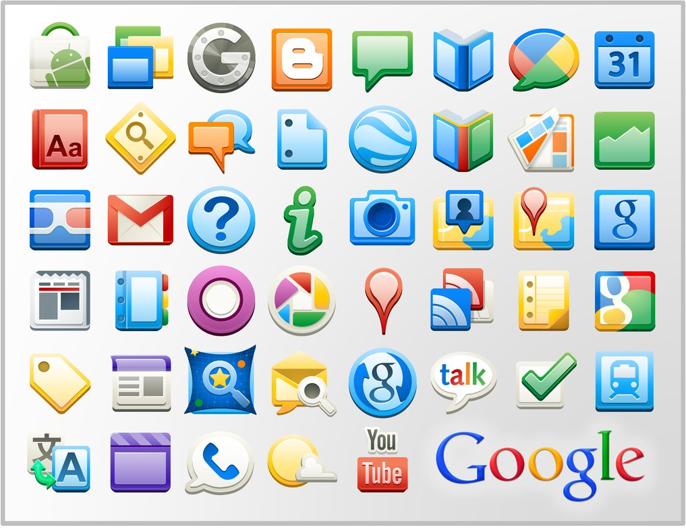
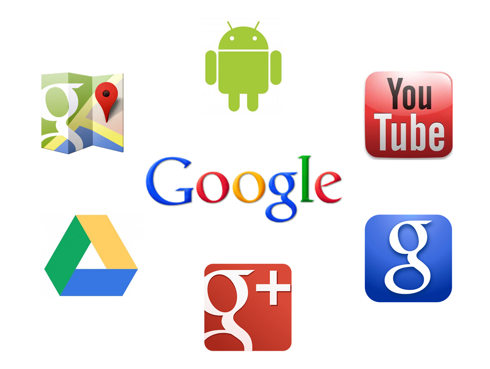
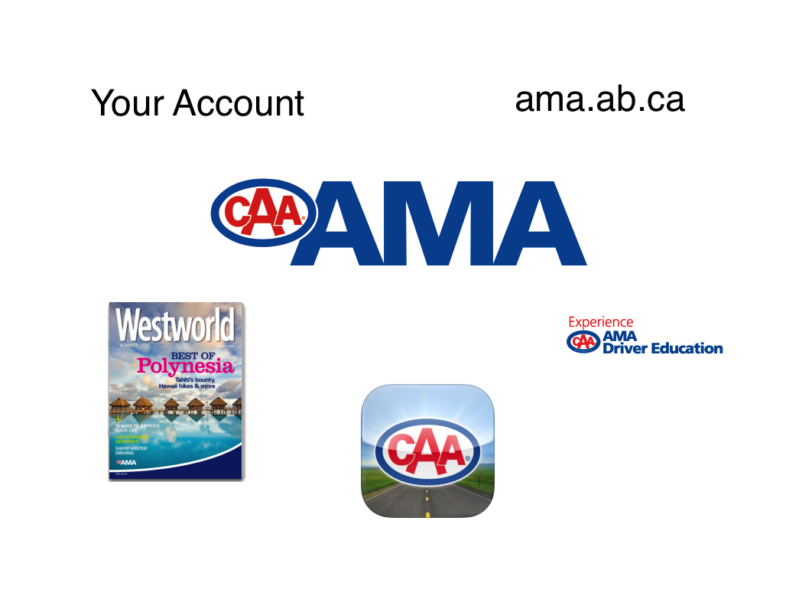
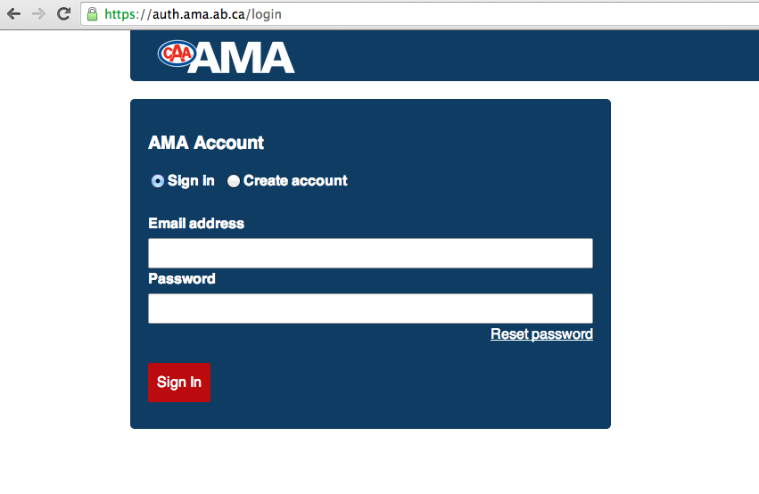
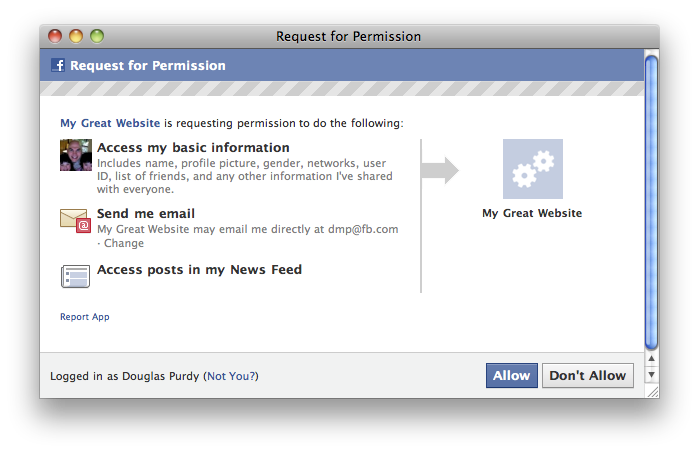

# oauth2-presentation

!SLIDE

###Central authentication done right.

Name: **Ryan Jones**  
Position: **Manager, Web Development**    
Email: **ryan.jones@ama.ab.ca**

!SLIDE left

# Overview  

* Why is Central Authentication Important?
* Before OAuth2 - The Dark Times
* How AMA is like Google (no joke!)
* Why OAuth2 Rocks
  * No Password Ferrying
  * Supported Platforms
  * Scopes
  * Revoke Tokens
  * Libraries
* Questions? Comments?

!SLIDE left

# Why is Central Authentication Important?

* 1 Login / 1 Password
* Change settings in 1 place (subscriptions, 2 factor, avatar, etc.)
* Imagine making 1 login per google service (yikes!)
 
 
  

!SLIDE left

# Before OAuth2 - The Dark Times

* Passing email/password (ferry passwords)
  * 3rd parties getting hacked
* OAuth1 
  * Lack of Platform support (mobile, javascript, etc.)
  * HMAC Signatures??
* SAML 1.1/2.0
  * Complicated
  * Lack of adoption
  * Big corporations (Banks, IBM, etc.)
  * Oldhat

!SLIDE left

# How AMA is like Google

* Google wants you to use your Google Account
* Google wants partner apps to interact with their API's - $$$

!SLIDE left

# How AMA is like Google

* AMA wants you to use your AMA Account
* AMA wants partner apps to interact with their API's - :) 

!SLIDE left

# Why OAuth2 Rocks

* No password ferrying (authorization_code)

* Login directly through AMA

!SLIDE left

# Why OAuth2 Rocks

* Support platforms.. All the platforms (grant_types)!
  * Native Mobile (iOS/Android/BB)
  * Web apps
  * Javascript (1 page apps/ajax)
  * Native (C#/Cocoa)

  

!SLIDE left

# Why OAuth2 Rocks

* Scopes

  * Explicit - Users know what they're allowing 3rd party apps to access
  

  * Implicit - Pass through (AMA uses this for trusted apps)

!SLIDE left

# Why OAuth2 Rocks 

* Revoke Tokens
  * Application
  * User
   
   
   
  

!SLIDE left

# Why OAuth2 Rocks

* Libraries
  * http://oauth.net/code/ - All the languages!
   
   
   
  

!SLIDE left

* Questions? Comments?
   
   
   
   
   
  
    

!SLIDE left

# Refs

* http://wiki.oauth.net/w/page/12238520/Logo -- OAuth2 Logo
* http://www.pokerupdate.com/assets/Managed/NewsArticles/hacker2.jpg -- Typing hacker keyboard
* OAuth2 vs SAML2 -- http://www.mutuallyhuman.com/blog/2013/05/09/choosing-an-sso-strategy-saml-vs-oauth2/
* http://setandbma.files.wordpress.com/2013/01/google.png -- Google Circle
* http://www.stavangertravel.com/news/newcastle-stavanger-bergen-ferry-update-december_2013.cfm -- No Ferry
* https://github.com/infews/keydown -- Used to make presentation
* http://ryanonrails.github.com/oauth2-presentation/slides.html -- Presentation url
* http://www.orbitvu.com.au/wp-content/uploads/6_cross-platform.png -- Cross platform
* http://kinlane-productions.s3.amazonaws.com/api-evangelist/oauth/oauth-additionalscope.png -- Scopes
* http://www.oliviawaite.com/blog/wp-content/uploads/2011/09/yoink128566261268737336.jpg -- Yoink
* http://microsoft-news.com/wp-content/uploads/2011/05/steve-ballmer-300x300.jpg -- Ballmer
* http://public.bn1.livefilestore.com/y2pSUkzJTx-IpocQb5QRCmCcG4q9p_qlfp5oo3tKWGP7X_Hs_I8UWFRMxQ2auE7ipcNNjheeuqigstVN727EsJ3XDDmvyFZIQchSd-E7P5Nc2Y/Help%2520Question%2520mark.png%3fpsid%3d1?rdrts=63952446 -- question mark
* http://th09.deviantart.net/fs70/PRE/i/2011/328/7/f/google_apps_icons_16px_512px_by_carlosjj-d4h5mlv.png -- google app icons
